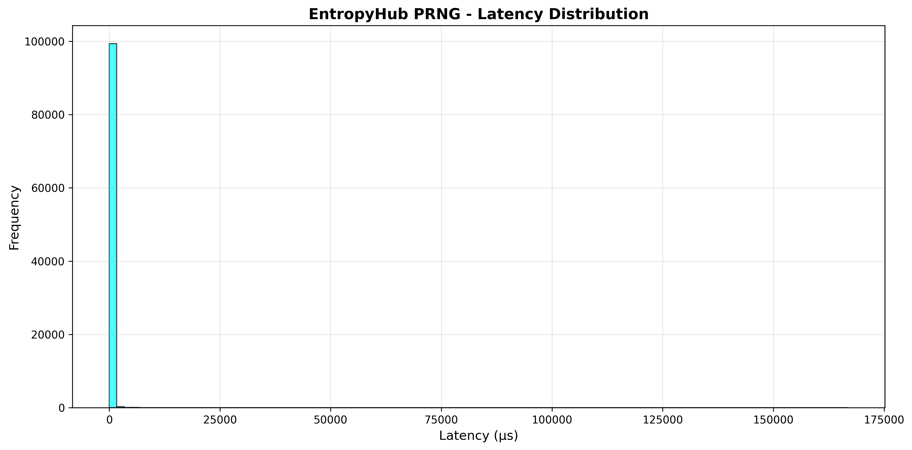
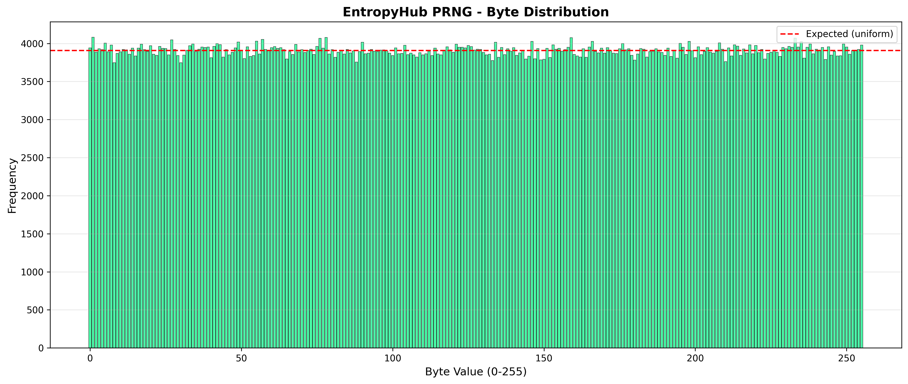
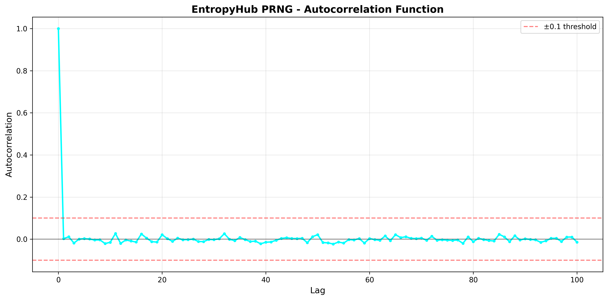
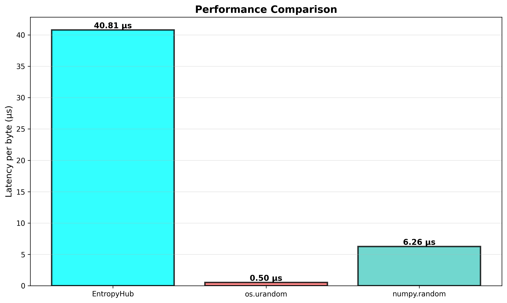

# EntropyHub PRNG - Benchmark Report

## Summary

**Engine:** Rust-optimized Rössler chaotic core  
**Version:** 2.1.0  
**Date:** 2026-03-13 00:24:41

---

## Performance Metrics

### Latency
- **Mean:** 155.349 µs
- **Median:** 63.900 µs
- **95th percentile:** 242.300 µs
- **99th percentile:** 1178.903 µs
- **Throughput:** 6437.11 MB/s

### Entropy Quality
- **Shannon Entropy:** 7.9998 bits/byte (ideal: 8.0)
- **Min-Entropy:** 7.9369 bits/byte
- **Chi-squared:** 266.44
- **Bit Balance:** 0.000188

### Correlation
- **Max Autocorrelation:** 0.026837
- **Mean Abs Correlation:** 0.009245

### Comparison
- **vs os.urandom:** 0.01x faster
- **vs numpy.random:** 0.15x faster

---

## Visualizations

---

**Generated by EntropyHub Comprehensive Benchmark Suite**
